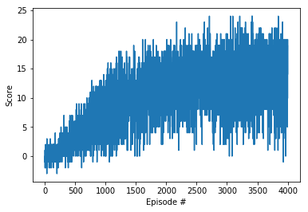

[//]: # (Image References)

[image1]: https://user-images.githubusercontent.com/10624937/42135619-d90f2f28-7d12-11e8-8823-82b970a54d7e.gif "Trained Agent"

# Project 1: Navigation

### Introduction

For this project, I trained an agent to navigate (and collect bananas!) in a large, square world.  

![Trained Agent][image1]

A reward of +1 is provided for collecting a yellow banana, and a reward of -1 is provided for collecting a blue banana.  Thus, the goal of your agent is to collect as many yellow bananas as possible while avoiding blue bananas.  

NNet.py contains basic network from nnModule.

dqn_agent.py contains the agent include the double q network structure.

Navigation_solution.ipynb contains the training and evaluation process code.

### Learning Algorithm

In this project we use double q network from Deep Q learning algrithm, which is described in the paper [Deep Q learning](https://storage.googleapis.com/deepmind-media/dqn/DQNNaturePaper.pdf).

Two deep q networks with the same structure are used:

- **`1`** - Fully collected layer, input dim 37, output dim 128. RELU activation.
- **`2`** - Fully collected layer, input dim 128, output dim 64. RELU activation.
- **`3`** - Fully collected layer, input dim 64, output dim 4.

The learning process lasts n_episodes. A memory is used to save all the steps in each episode. The memory class can add (state, action, reward, next_state, done) tuple and randomly sample a batch of tuples from the buffer. The local_network is updated every N steps and the target_network is soft-updated based on the local-network weight.

During the training, in each step, an action is predicted based on current q local_network. A Monte-Carlo greedy search algorithm is used to determine whether the agent will follow the action based on q local_network or take random action. For every N steps, we randomly sample a batch of (state, action, reward, next_state, done) tuple and get the target q values from qtarget_network and reward. Then, we can get the predicted q values by q local_network. The loss is the mean square loss of (q target, q local). Using Adam optimizer we can optimize the loss. After the training, we update the target network parameters to be a linear combination of old target network and the local network.

### Hyper parameters

LR = 1e-3   # this the the learning rate for the deep q network.

BUFFER_SIZE = int(1e6)   # this is the size for the replay memory.

UPDATE_CYCLE = 8         # the weight is trained every 8 steps.

batch_size = 64          # the batch size for each training of the deep q network.

GAMMA = 0.99             # reward decay factor.

TAU = 1e-3               # soft_update parameter, the portion of new local_parameters are updated to target parameters.

### Results

Follow the instructions in `Navigation_solution.ipynb` to train the agent! After 4000 episodes, the average score is about 13.2.
In the evaluation run, 3 full episodes are tested and the average score is above 15. All these show that the agent has learned how to play the game very well.

### Idea for future work
- **`1`** - Learning from pixel directly instead from representative array state.
- **`2`** - Optimize hyper-parameters to accelerate the learning speed
- **`3`** - Dueling network structure instead of double-q network
- **`4`** - Rainbow learning algorithm.
